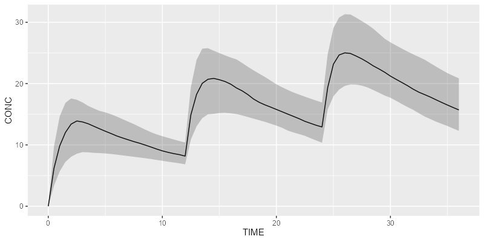

# campsis 

<!-- badges: start -->

[](https://github.com/Calvagone/campsis/actions)
[](https://app.codecov.io/gh/Calvagone/campsis)
[](https://cran.r-project.org/package=campsis)
[](https://cran.r-project.org/package=campsis)
[](https://cran.r-project.org/package=campsis)
<!-- badges: end -->

## Requirements

- R package `campsismod` must be installed beforehand
- Simulation engine must be installed too (`rxode2` or `mrgsolve`)

## Installation

Install the latest stable release using `devtools`:

``` r
devtools::install_github("Calvagone/campsis")
```

## Basic example

Import the `campsis` package:

``` r
library(campsis)
```

Create your dataset:

``` r
ds <- Dataset(50) %>%
  add(Bolus(time=0, amount=1000, ii=12, addl=2)) %>%
  add(Observations(times=seq(0, 36, by=0.5)))
```

Load your own model or use a built-in model from the library:

``` r
model <- model_suite$pk$`2cpt_fo`
```

Simulate your results with your preferred simulation engine (`rxode2` or
`mrgsolve`):

``` r
results <- model %>% simulate(dataset=ds, dest="rxode2", seed=1)
```

Plot your results:

``` r
shadedPlot(results, "CONC")
```


