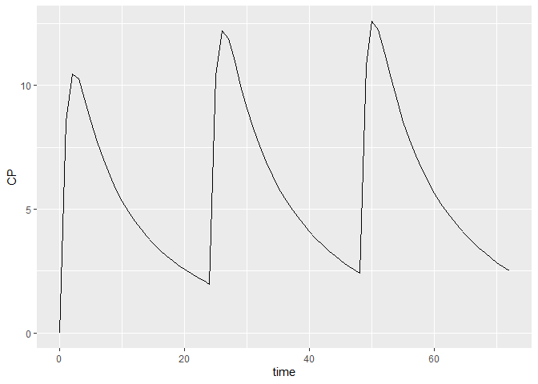
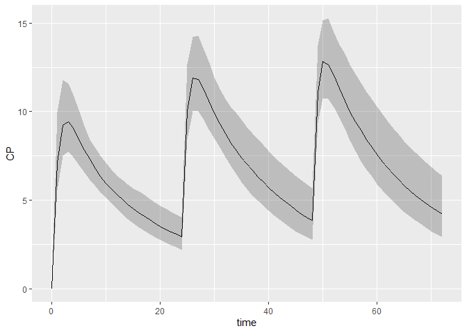
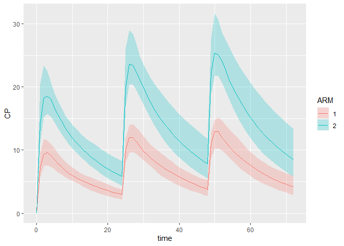
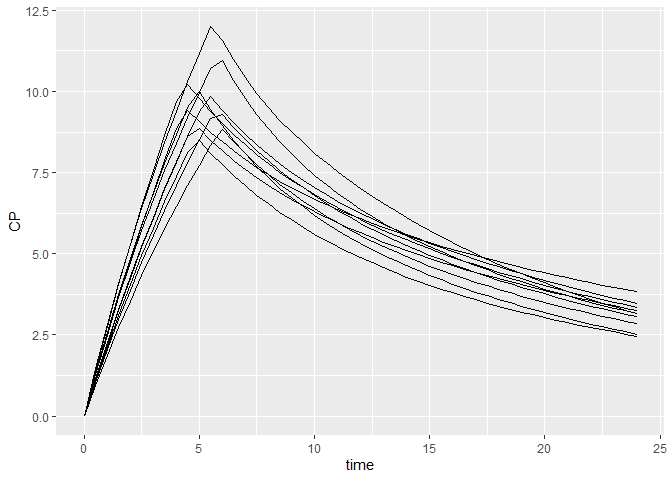

# pmxsim

A generic clinical trial simulation platform.

## Requirements

-   R package `pmxmod` must be installed beforehand
-   Simulation engine must be installed too (e.g. `RxODE`)

## Installation

Install the current development version:

``` r
remotes::install_github("Calvagone/pmxsim@dev")
```

## Some examples

### Simulate boluses

First import the `pmxmod` and `pmxsim` packages:

``` r
library(pmxmod)
library(pmxsim)
```

Load 2-compartment PK model from built-in model library:

``` r
model <- getNONMEMModelTemplate(advan=4, trans=4)
```

Create your dataset using `pmxsim`. For instance, let’s give 1000mg QD
for 3 days and observe every hour.

``` r
dataset <- Dataset()
dataset <- dataset %>% add(Bolus(time=0, amount=1000))
dataset <- dataset %>% add(Bolus(time=24, amount=1000))
dataset <- dataset %>% add(Bolus(time=48, amount=1000))
dataset <- dataset %>% add(Observations(times=seq(0,72, by=1)))
```

See all methods that can be applied on a dataset:

``` r
methods(class=class(dataset))
```

    ## [1] add                  export               hasModelDistribution
    ## [4] length               simulate            
    ## see '?methods' for accessing help and source code

``` r
showMethods("add", classes=class(dataset))
```

    ## Function: add (package pmxmod)
    ## object="dataset", x="arm"
    ## object="dataset", x="bolus"
    ##     (inherited from: object="dataset", x="treatment_entry")
    ## object="dataset", x="covariate"
    ## object="dataset", x="dataset_config"
    ## object="dataset", x="observation"
    ## object="dataset", x="observations"
    ## object="dataset", x="treatment_characteristic"
    ## object="dataset", x="treatment_entry"
    ## object="dataset", x="treatment_iov"

Simulate this very simple protocol:

``` r
results <- model %>% simulate(dataset, dest="RxODE", seed=1)
```

    ## qs v0.23.5.

``` r
head(results)
```

    ## # A tibble: 6 x 16
    ##    time    KA    CL    V2    V3     Q    S2   ARM     F    CP OBS_CP     Y
    ##   <dbl> <dbl> <dbl> <dbl> <dbl> <dbl> <dbl> <dbl> <dbl> <dbl>  <dbl> <dbl>
    ## 1     0  1.05  6.43  70.1  20.6  3.62  70.1     0  0     0      0     0   
    ## 2     1  1.05  6.43  70.1  20.6  3.62  70.1     0  8.56  8.56   8.22  8.22
    ## 3     2  1.05  6.43  70.1  20.6  3.62  70.1     0 10.5  10.5   12.5  12.5 
    ## 4     3  1.05  6.43  70.1  20.6  3.62  70.1     0 10.3  10.3   10.5  10.5 
    ## 5     4  1.05  6.43  70.1  20.6  3.62  70.1     0  9.45  9.45   9.64  9.64
    ## 6     5  1.05  6.43  70.1  20.6  3.62  70.1     0  8.56  8.56  10.5  10.5 
    ## # ... with 4 more variables: A_DEPOT <dbl>, A_CENTRAL <dbl>,
    ## #   A_PERIPHERAL <dbl>, A_OUTPUT <dbl>

Plot these results:

``` r
spaguettiPlot(results, "CP")
```

<!-- -->

Simulate more subjects:

``` r
dataset <- Dataset(subjects=100)
dataset <- dataset %>% add(Bolus(time=0, amount=1000))
dataset <- dataset %>% add(Bolus(time=24, amount=1000))
dataset <- dataset %>% add(Bolus(time=48, amount=1000))
dataset <- dataset %>% add(Observations(times=seq(0,72, by=1)))
results <- model %>% simulate(dataset, dest="RxODE", seed=1)
spaguettiPlot(results, "CP")
```

<!-- -->

A shaded plot may also be used:

``` r
shadedPlot(results, "CP")
```

<!-- -->

We could also simulate two different treatment arms. Say the first arm
receives 1000mg QD and the second arm 2000mg QD.

``` r
arm1 <- Arm(id=1, subjects=50)
arm2 <- Arm(id=2, subjects=50)

arm1 <- arm1 %>% add(Bolus(time=0, amount=1000))
arm1 <- arm1 %>% add(Bolus(time=24, amount=1000))
arm1 <- arm1 %>% add(Bolus(time=48, amount=1000))
arm1 <- arm1 %>% add(Observations(times=seq(0,72, by=1)))

arm2 <- arm2 %>% add(Bolus(time=0, amount=2000))
arm2 <- arm2 %>% add(Bolus(time=24, amount=2000))
arm2 <- arm2 %>% add(Bolus(time=48, amount=2000))
arm2 <- arm2 %>% add(Observations(times=seq(0,72, by=1)))

dataset <- Dataset() %>% add(arm1) %>% add(arm2)

results <- model %>% simulate(dataset, dest="RxODE", seed=1)
shadedPlot(results, "CP", scenarios="ARM")
```

<!-- -->

### Simulate infusions

Load 2-compartment PK model without absorption from built-in model
library:

``` r
model <- getNONMEMModelTemplate(advan=3, trans=4)
```

1000mg is infused in central compartment in 5 hours of time.

``` r
dataset <- Dataset(10)
dataset <- dataset %>% add(Infusion(time=0, amount=1000, compartment=1))
dataset <- dataset %>% add(Observations(times=seq(0,24, by=0.5)))

# 5 hours duration
dataset <- dataset %>% add(InfusionDuration(compartment=1, distribution=ConstantDistribution(5)))

results <- model %>% simulate(dataset, dest="RxODE", seed=1)
spaguettiPlot(results, "CP")
```

<!-- -->

Let’s add some variability on the infusion duration:

``` r
dataset <- Dataset(10)
dataset <- dataset %>% add(Infusion(time=0, amount=1000, compartment=1))
dataset <- dataset %>% add(Observations(times=seq(0,24, by=0.5)))

# 5 hours duration, with 20% CV
dataset <- dataset %>% add(InfusionDuration(compartment=1, distribution=LogNormalDistribution(meanlog=log(5), sdlog=0.2)))

results <- model %>% simulate(dataset, dest="RxODE", seed=1)
spaguettiPlot(results, "CP")
```

<!-- -->
