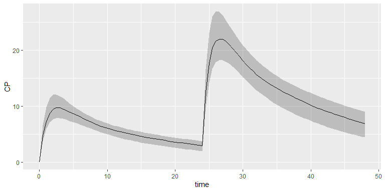

## Requirements

-   R package `pmxmod` must be installed beforehand
-   Simulation engine must be installed too (either `RxODE` or
    `mrgsolve`)

## Installation

Install the latest stable release with the authentication token you have
received:

``` r
devtools::install_github("Calvagone/pmxsim", ref="release", auth_token="AUTH_TOKEN", dependencies="pmxmod", force=TRUE)
```

## Basic example

Create your dataset:

``` r
ds <- Dataset(50)
ds <- ds %>% add(Bolus(time=0, amount=1000))
ds <- ds %>% add(Bolus(time=24, amount=2000))
ds <- ds %>% add(Observations(times=seq(0, 48, by=0.5)))
```

Load your own model or use a built-in model from the library:

``` r
model <- model_library$advan4_trans4
```

Simulate your results with your preferred simulation engine:

``` r
results <- model %>% simulate(dataset=ds, dest="RxODE", seed=1)
```

Plot your results:

``` r
shadedPlot(results, "CP")
```


